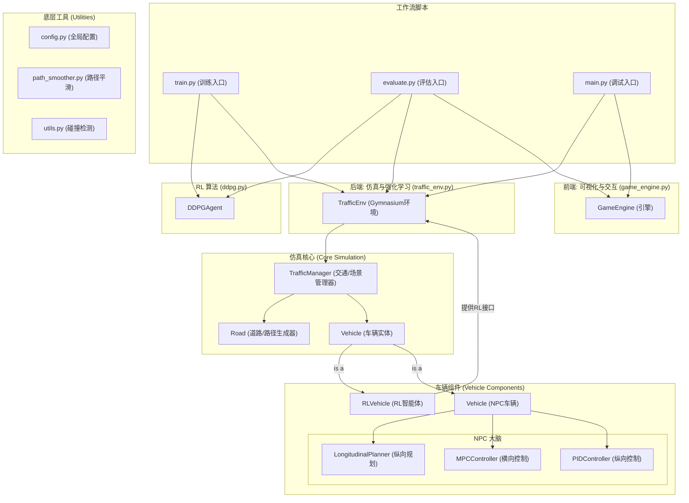

# 强化学习驱动的十字路口自主驾驶仿真平台

## 1. 项目简介

本项目是一个基于 Python 和 Pygame 构建的、面向强化学习研究的二维十字路口交通仿真平台。它旨在为开发和测试自主驾驶决策算法（尤其是无信号交叉口的通行策略）提供一个功能丰富、高度可配置且物理模型精确的虚拟环境。

平台的核心特性包括：

* **完整的RL工作流**: 提供了从**训练 (`train.py`)** 到 **评估 (`evaluate.py`)** 的完整脚本，支持无头（headless）训练和可视化评估。
* **模块化架构**: 仿真后端（物理模型、交通管理）与可视化前端（游戏引擎）完全解耦。
* **标准化接口**: 遵循 [Gymnasium](https://gymnasium.farama.org/) (前身为 Gym) 标准接口，可与主流强化学习框架（如 Stable Baselines3, Tianshou, RLlib）无缝集成。
* **分层式控制系统**: 背景车辆（NPC）采用了一套复杂的、分层的“规划-控制”架构，使其行为更加真实和智能。
* **高精度动力学与路径**: 采用基于“自行车模型”的车辆动力学模型，并为所有车辆规划经过平滑和等距重采样处理的高质量行驶路径。
* **可定制的交通场景**: 支持通过“场景”模式，一键生成特定的、可复现的交通冲突情景，极大地方便了算法的针对性训练和评估。

## 2. 项目架构

本项目的架构设计遵循高内聚、低耦合的原则，将不同职责清晰地划分到各个模块中。



**工作流程**:
1.  **训练**: 运行 `train.py`，它会创建 `TrafficEnv` 和 `DDPGAgent`，在无图形界面的模式下进行高速训练，并通过 `TensorBoard` 记录日志，定期保存模型。
2.  **评估**: 运行 `evaluate.py`，它会创建 `TrafficEnv`, `GameEngine` 和 `DDPGAgent`，加载训练好的模型，并在可视化环境中展示智能体的驾驶策略。
3.  **调试**: 运行 `main.py`，它会使用**随机动作**来驱动智能体，主要用于测试环境本身的功能和交互。

## 3. 安装与环境配置

**依赖库**:
本项目依赖以下 Python 库。建议使用 `pip` 进行安装。

* `pygame-ce`: 用于构建可视化引擎。
* `numpy`: 用于进行科学计算和矩阵运算。
* `scipy`: 用于路径重采样中的三次样条插值。
* `casadi`: 用于模型预测控制器（MPC）的符号计算和非线性规划求解。
* `gymnasium`: 强化学习环境的标准接口。
* `matplotlib`: 用于在回合结束时绘制数据图表。
* `torch`: 深度学习框架，用于实现DDPG算法。
* `tensorboard`: 用于训练过程的可视化监控。

**建议安装步骤**:

1.  **创建虚拟环境 (推荐)**:
    ```bash
    python -m venv venv
    source venv/bin/activate  # On Windows, use `venv\Scripts\activate`
    ```

2.  **安装依赖**:
    ```bash
    pip install pygame-ce numpy scipy casadi gymnasium matplotlib torch tensorboard
    ```

## 4. 使用方法

### 步骤一：训练智能体
打开终端，运行 `train.py` 开始训练。
```bash
python train.py
```
* 训练过程是无图形界面的（Headless），以获得最快的训练速度。
* 训练日志会保存在 `runs/` 目录下。您可以启动 TensorBoard 来实时监控训练过程：
    ```bash
    tensorboard --logdir=runs
    ```
* 模型权重文件（例如 `ddpg_episode_50.pth`）会周期性地保存在项目根目录。

### 步骤二：评估智能体
训练完成后，您可以在可视化环境中评估智能体的表现。

1.  打开 `evaluate.py` 文件。
2.  修改 `MODEL_PATH` 变量，使其指向您想要评估的模型文件，例如：
    ```python
    MODEL_PATH = "ddpg_episode_500.pth" # 替换为您训练好的模型
    ```
3.  保存文件，然后在终端运行：
    ```bash
    python evaluate.py
    ```
* 一个 Pygame 窗口将会打开，展示您的智能体在不同场景下的驾驶行为。

### （可选）手动交互与调试
如果您想在没有AI的情况下，仅使用随机动作与环境交互来测试或调试，可以运行 `main.py`。
```bash
python main.py
```

### 交互快捷键 (在 `evaluate.py` 或 `main.py` 运行时)
* **`Space` / `P`**: 暂停 / 恢复 仿真。
* **`鼠标左键拖拽`**: 平移视角。
* **`鼠标滚轮`**: 缩放视角。
* **`R`**: 重置当前仿真场景。
* **`H`**: 在屏幕上显示/隐藏帮助菜单。
* **`ESC` / `Q`**: 退出程序。

## 5. 代码模块详解

* **`train.py` / `evaluate.py`**: 项目的**核心工作流**。`train.py` 负责无头训练和保存模型，`evaluate.py` 负责加载模型并进行可视化评估。
* **`main.py`**: 项目的**调试入口**，使用随机动作驱动智能体。
* **`ddpg.py`**: 实现了 DDPG 强化学习算法，包含 Actor-Critic 网络和经验回放池。
* **`game_engine.py`**: 前端可视化引擎，与仿真逻辑完全分离。
* **`traffic_env.py`**: 实现了 `gym.Env` 接口，是RL算法与仿真世界交互的桥梁。
* **`traffic.py`**: `TrafficManager` 类，负责车辆生命周期管理和**场景搭建**。
* **`road.py` & `path_smoother.py`**: 定义道路几何，并使用平滑工具生成高质量轨迹。
* **`vehicle.py`**: 定义了 `Vehicle` (NPC) 和 `RLVehicle` (智能体)。NPC拥有完整的决策-控制栈，而RL智能体则为RL算法提供了观测、奖励等核心接口。
* **`longitudinal_planner.py`**: NPC车辆的**高级决策模块**，负责让行等复杂行为。
* **`longitudinal_control.py` & `lateral_control.py`**: 底层的 **PID** 和 **MPC** 执行控制器。
* **`utils.py` & `config.py`**: 分别提供**碰撞检测**工具和**全局配置**参数。

## 6. 后续开发建议

1.  **正式开始训练**:
    * 运行 `train.py`。根据机器性能，这可能需要数小时。
    * 通过 `tensorboard` 密切关注奖励曲线，判断算法是否收敛。

2.  **调试与调优**:
    * **奖励函数**: `RLVehicle.calculate_reward()` 中的权重是核心超参数，直接影响最终策略的好坏。
    * **观测空间**: `RLVehicle.get_observation()` 定义了智能体能“看到”什么。可以尝试增减特征。
    * **DDPG超参数**: `ddpg.py` 中的学习率、折扣因子、网络结构等都会影响训练效果。

3.  **扩展新场景**:
    * 在 `TrafficManager.setup_scenario()` 中可以轻松添加新的 `elif` 分支，创建更复杂的测试场景，以检验模型的泛化能力。